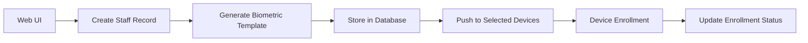
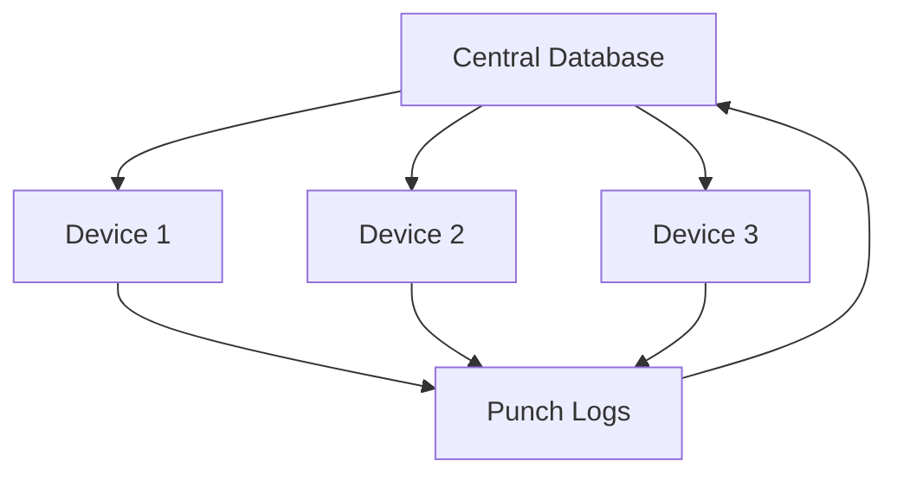

# Punch Clock Synchronization & Attendance System - Technical Specification

## System Overview

The punch clock synchronization and attendance reporting tool is designed to manage biometric attendance tracking across multiple ZKTeco devices, providing centralized staff management, device synchronization, and comprehensive attendance reporting for payroll processing.

## Core Entities and Relationships

### 1. Staff Management
**Purpose**: Central repository for all employee information

**Key Relationships**:
- **Staff** → **Biometric Templates** (1:Many)
  - Each staff member can have multiple biometric templates (fingerprints, face)
- **Staff** → **Device Enrollments** (1:Many)
  - Track which devices each staff member is enrolled on
- **Staff** → **Punch Logs** (1:Many)
  - All punch in/out records for the staff member
- **Staff** → **Attendance Records** (1:Many)
  - Daily attendance summaries

**Key Fields**:
- `employee_id`: Unique internal identifier
- `badge_number`: Physical card/badge number
- `enrollment_status`: Tracks overall enrollment progress

### 2. Device Management
**Purpose**: Manage physical ZKTeco punch clock devices

**Key Relationships**:
- **Devices** → **Device Enrollments** (1:Many)
  - Track all staff enrolled on each device
- **Devices** → **Punch Logs** (1:Many)
  - All attendance logs from the device
- **Devices** → **Sync Logs** (1:Many)
  - History of synchronization operations

**Key Fields**:
- `device_serial`: Unique device identifier
- `ip_address`: For network connectivity
- `last_sync_at`: Track synchronization status
- `device_config`: JSON storage for device-specific settings

### 3. User & Role Management
**Purpose**: Control system access and permissions

**Key Relationships**:
- **Users** → **User Roles** → **Roles** (Many:Many)
- **Roles** → **Role Permissions** → **Permissions** (Many:Many)

**Permission Model**:
```
Resource-based permissions:
- Resource: staff, devices, reports, attendance
- Actions: create, read, update, delete, sync, export, approve
```

### 4. Biometric Data
**Purpose**: Store and manage biometric templates

**Key Fields**:
- `template_type`: FINGERPRINT, FACE, PALM
- `template_data`: Base64 encoded biometric data
- `quality_score`: Template quality (0-100)
- `finger_index`: For fingerprint identification (0-9)

### 5. Attendance Tracking
**Purpose**: Raw logs and processed attendance records

**Two-tier System**:
1. **Punch Logs**: Raw data from devices
2. **Attendance Records**: Processed daily summaries

**Processing Flow**:
```
Punch Logs → Processing Engine → Attendance Records
                    ↓
              Validation Rules
              - Time calculations
              - Shift matching
              - Anomaly detection
```

## Data Synchronization Flow

### 1. Initial Enrollment


### 2. Attendance Data Flow


### 3. Cross-Device Synchronization


## Implementation Considerations

### 1. Biometric Template Storage
- **Security**: Encrypt template_data at rest
- **Format**: Store as Base64 encoded strings
- **Compatibility**: Maintain template_format field for version tracking

### 2. Device Communication
- **SDK Integration / Protocol**: Use device integration api
- **Heartbeat**: Regular heartbeat checks to track device online status

### 3. Synchronization Strategy
- **Incremental Sync**: Track last_sync_at for delta synchronization
- **Conflict Resolution**: Latest timestamp wins for conflicting data
- **Retry Logic**: Implement exponential backoff for failed syncs
- **Batch Processing**: Process attendance logs in batches for efficiency

### 4. Data Integrity
- **Unique Constraints**:
  - One attendance record per staff per day
  - Unique device serial numbers
  - Unique employee IDs and badge numbers
- **Referential Integrity**:
  - Prevent deletes for related records

### 6. Reporting Requirements
- **Daily Reports**: Attendance summaries, late arrivals, absences
- **Period Reports**: Monthly attendance, overtime calculations
- **Export Formats**: CSV for payroll systems, Excel for HR, PDF for records
- **Real-time Dashboard**: Current day attendance, device status

### 7. Security Considerations
- **Encryption**:
  - Biometric data encryption at rest
  - TLS for device communication
  - Encrypted backups
- **Access Control**:
  - Role-based permissions
  - Audit logging for all changes
  - Session management

### 8. Scalability Planning
- **Multi-tenancy**: Database, backend and device integration api instance per organisation.
- **Queue System**: Implement message queue for async processing

## API Endpoints Structure

### Staff Management
```
POST   /api/staff                 - Create new staff
GET    /api/staff                 - List all staff
GET    /api/staff/{id}           - Get staff details
PUT    /api/staff/{id}           - Update staff
DELETE /api/staff/{id}           - Delete staff
POST   /api/staff/{id}/enroll    - Initiate enrollment
GET    /api/staff/{id}/biometrics - Get biometric templates
```

### Device Management
```
POST   /api/devices               - Add new device
GET    /api/devices               - List all devices
GET    /api/devices/{id}         - Get device details
PUT    /api/devices/{id}         - Update device
DELETE /api/devices/{id}         - Remove device
POST   /api/devices/{id}/sync    - Trigger synchronization
GET    /api/devices/{id}/status  - Get device status
```

### Attendance
```
GET    /api/attendance/logs      - Get punch logs
GET    /api/attendance/records   - Get attendance records
POST   /api/attendance/process   - Process raw logs
PUT    /api/attendance/records/{id} - Modify attendance
POST   /api/attendance/approve   - Approve attendance
```

### Reporting
```
GET    /api/reports/daily        - Daily attendance report
GET    /api/reports/monthly      - Monthly summary
GET    /api/reports/payroll      - Payroll export
POST   /api/reports/custom       - Custom report generation
```

## Technology Stack Recommendations

### Backend
- **Framework**: Node.js with Express / Python with FastAPI / .NET Core
- **ORM**: Sequelize / SQLAlchemy / Entity Framework
- **Queue**: RabbitMQ / Redis Queue for async processing
- **Cache**: Redis for session and data caching

### Database
- **Primary**: PostgreSQL (for JSONB support and reliability)
- **Time-series**: Consider TimescaleDB for punch log data

### Device Integration
- **SDK**: ZKTeco SDK or pyzk (Python library)
- **Protocol**: TCP/IP socket communication
- **Fallback**: HTTP API if available on newer devices

### Frontend
- **Framework**: React / Vue.js / Angular
- **UI Library**: Material-UI / Ant Design
- **State Management**: Redux / Vuex
- **Real-time Updates**: WebSockets for live attendance

### Infrastructure
- **Containerization**: Docker for deployment
- **Orchestration**: Kubernetes for scaling
- **Monitoring**: Prometheus + Grafana
- **Logging**: ELK Stack (Elasticsearch, Logstash, Kibana)

## Error Handling Strategy

### Device Communication Errors
- Implement retry mechanism with exponential backoff
- Queue failed operations for later retry
- Alert administrators on repeated failures

### Data Validation Errors
- Validate all inputs at API level
- Implement business rule validation
- Log validation failures for audit

### Synchronization Conflicts
- Implement conflict resolution strategy
- Maintain sync error logs
- Provide manual resolution interface

## Testing Strategy

### Unit Tests
- Model validation
- Business logic
- Utility functions

### Integration Tests
- Database operations
- Device communication
- API endpoints

### End-to-End Tests
- Complete enrollment flow
- Attendance processing
- Report generation
